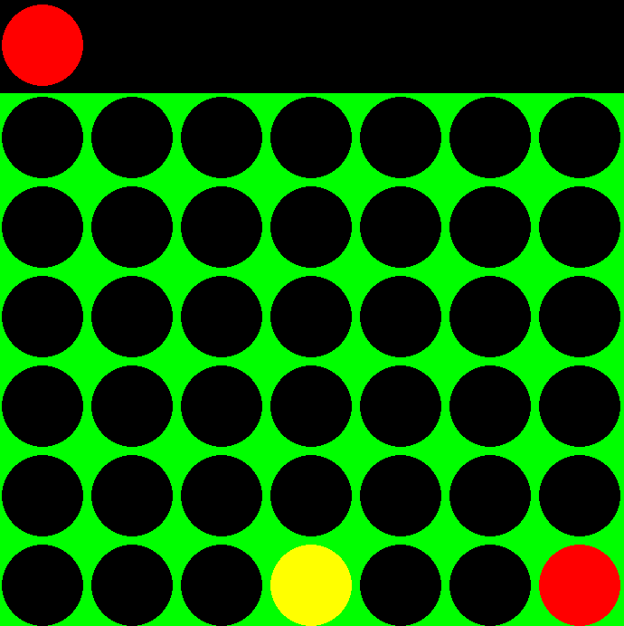

# 🎮 Connect 4 (Python + Pygame)

A fully playable **Connect 4** game built with Python and Pygame, featuring a clean architecture, AI opponent, and responsive UI.

## ✨ Features:

# 🎮 Game Modes
- Player vs Player (local hot-seat)
- Player vs AI

# 🤖 AI Opponent
A heuristic-based AI that evaluates board positions and prioritises:
- Winning moves
- Blocking opponent wins
- Center column control
- Simple positional advantages
- Can be extended to minimax / alpha-beta pruning for stronger gameplay.

---

# 🖥️ Responsive UI
- Fully resizable window
- Dynamic board scaling
- Centered grid layout
- Hover preview for current column
- Clean menu and game-over screens

---

# 🧠 Game Logic
- Accurate win detection (horizontal, vertical, diagonal)
- Gravity-based piece placement
- Column validation
- Turn-based system supporting both PvP and AI modes

---

# 🧱 Project Structure

connect-four/
│ 
├── game.py # Main game loop + state machine 
├── board.py # Core game logic (board, moves, win detection) 
├── ui.py # Rendering (menu, board, game over) 
├── ai.py # AI move selection 
├── constants.py # Shared constants (colors, dimensions) 

## 🔁 Game Flow

The game runs using a simple **state machine**:

- MENU
- PLAYING
- GAME_OVER

Each frame:
1. Handle input events
2. Update game state
3. Render the correct screen

This separation keeps rendering, logic, and input clean and modular.

---

## 🧠 AI Logic Overview

The AI evaluates all possible moves using a scoring system based on:

- Immediate win detection
- Blocking opponent wins
- Center column preference
- Positional heuristics

This produces a reactive and competitive opponent without heavy computation.

---

## 📦 Requirements

bash
pip install pygame numpy
python game.py

# 🎯 Controls
Menu 
P → Player vs Player 
A → Player vs AI 
Q → Quit 
Gameplay 
Move mouse → preview column 
Click → drop piece 
Game Over 
R → Restart game 